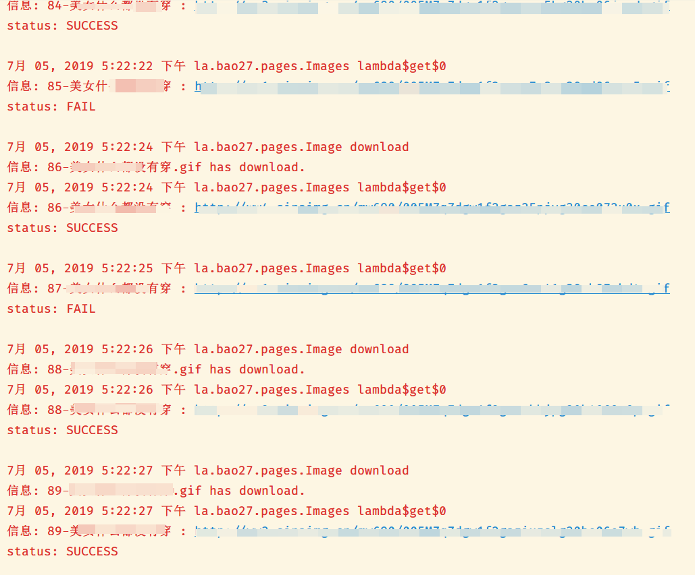

# Bao**爬虫

 

## 💡简介

我是一只纯洁的爬虫，提升你的灵魂层次。

爬取网站: [27bao](<https://www.27bao.la/>)

## 📃技术

- HTTP通信: [http-request](<https://github.com/kevinsawicki/http-request>)
- 文档解析: [jsoup](https://jsoup.org/)
- 序列化: [fastjson](https://github.com/alibaba/fastjson)
- 工具: [project-lombok](https://projectlombok.org/)
- 包管理器: [gradle](https://gradle.org/)

## ✨功能

- 分布式爬取

- 断点续载

- 伪造请求

- ...

  

*截图就放一张好了...*

## 🎉安装

- 克隆项目到本地
- 修改 `config/Download` 类中的字段
- 使用[gradle](https://gradle.org/)安装依赖
- 开启IDE的注解编译功能

## 🌞协议

LGPL-3.0

## 🔔声明

本项目仅做技术交流使用，任何人无论以何种形式将其用在任何地方由此引发的各种问题均与本人无关。